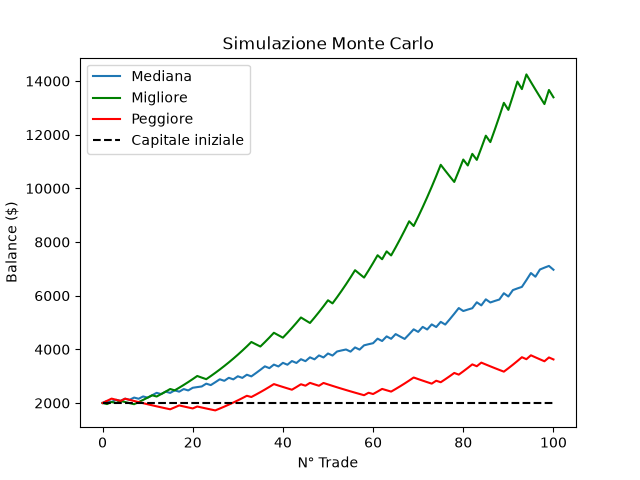

# Monte Carlo Simulator

Simulatore Monte Carlo per una strategia di trading. Ripete una serie di operazioni molte volte, con esiti casuali, per mostrare quanto può variare il capitale finale e il drawdown massimo.

## Cosa fa

Il programma simula una strategia con win rate, rischio per operazione e rapporto rischio/rendimento (RR) scelti dall'utente.

- Ogni operazione vince o perde in base al win rate. Se vince, il capitale cresce del rischio moltiplicato per l'RR. Se perde, cala del solo rischio.
- Il rischio è una percentuale del capitale del momento, quindi i guadagni e le perdite si reinvestono.
- Una serie è composta dal numero di trade scelto. Il programma la ripete per il numero di simulazioni scelto.
- Per ogni serie registra il capitale finale, il drawdown massimo (la perdita massima rispetto al picco) e il capitale dopo ogni trade.
- Alla fine calcola le statistiche su tutte le simulazioni e disegna il grafico.

Il programma non considera commissioni, slippage né cambiamenti del win rate nel tempo: è un modello semplificato, pensato per capire la variabilità dei risultati.

## Requisiti

- Python 3.11 o superiore
- Le librerie elencate in `requirements.txt` (matplotlib per il grafico, pytest per i test)

Il grafico usa il backend `TkAgg` di matplotlib, che richiede `tkinter`: è incluso nelle installazioni standard di Python su Windows.

Installazione delle librerie, dalla cartella del progetto:

```
pip install -r requirements.txt
```

## Come si lancia

Dalla cartella del progetto:

```
python main.py
```

I test si lanciano con:

```
pytest
```

## Parametri

Il programma chiede in ordine:

- **Win Rate** (da 0 a 100, in percentuale): percentuale di trade vincenti. Esempio: `55`
- **Capitale** (maggiore di 0): capitale iniziale in dollari. Esempio: `2000`
- **Rischio su capitale** (da 0 a 100, in percentuale): quota del capitale rischiata per ogni trade. Esempio: `2`
- **RR** (da 0 a 100): rapporto tra guadagno e rischio. Con `2`, una vittoria vale il doppio della perdita. Esempio: `2`
- **Numero di trade** (intero maggiore di 0): operazioni per serie. Esempio: `100`
- **Numero di simulazioni** (intero maggiore di 0): quante serie ripetere. Esempio: `100`
- **Limite drawdown** (da 0 a 100, in percentuale): soglia oltre la quale una simulazione è considerata "a rischio". Esempio: `10`

## Esempio di esecuzione

Esempio con questi parametri: win rate 55, capitale 2000, rischio 2%, RR 2, 100 trade, 100 simulazioni, limite drawdown 10%. I valori cambiano a ogni esecuzione, perché le simulazioni sono casuali.

```
Win Rate: 55
Capitale: 2000
Rischio su capitale: 2
RR: 2
Numero di trade: 100
Numero di simulazioni: 100
Limite drawdown: 10

Gain medio: 267.02%
Gain mediano: 248.34%

Balance medio: 7,340.48$
Mediana balance: 6,966.86$

Drawdown medio: 11.61%
Mediana Drawdown: 11.42%

Balance minimo: 3,623.74$
Balance massimo: 13,394.21$

Drawdown minimo: 5.88%
Drawdown massimo: 24.73%

Numero di violazioni della soglia di drawdown: 55
Percentuale di simulazioni oltre la soglia: 55.00%
```

Come leggere i risultati:

- **Gain**: variazione percentuale del capitale rispetto a quello iniziale, calcolata sulla media e sulla mediana dei balance finali.
- **Balance minimo e massimo**: il capitale finale peggiore e migliore tra tutte le simulazioni.
- **Drawdown**: la perdita massima dal picco, per simulazione.
- **Violazioni**: quante simulazioni hanno superato il limite di drawdown inserito.

## Grafico



Il grafico mostra l'andamento del capitale trade per trade:

- **Mediana** (blu): il valore centrale del capitale a ogni trade, tra tutte le simulazioni.
- **Migliore** (verde): la simulazione che finisce con il balance più alto.
- **Peggiore** (rosso): la simulazione che finisce con il balance più basso.
- **Capitale iniziale** (nero, tratteggiata): il punto di partenza. Sopra la linea c'è guadagno, sotto c'è perdita.

## Test

I test si trovano in `test_montecarlo.py` e controllano:

- il calcolo del drawdown con valori noti
- la simulazione con win rate 0 e 100, dove il risultato è deterministico
- le statistiche su un piccolo insieme di dati
- la struttura dei dati restituiti dalla simulazione Monte Carlo